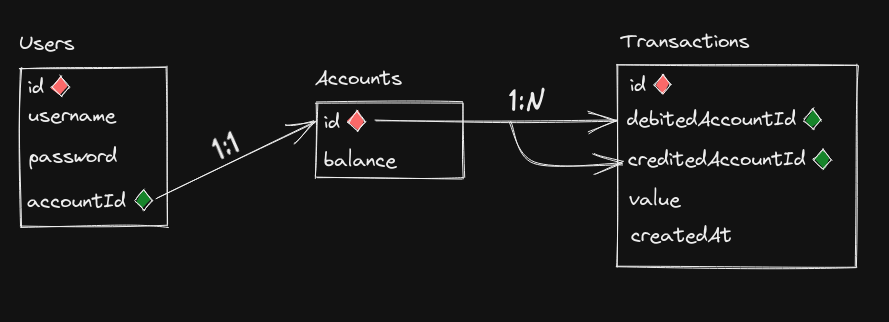
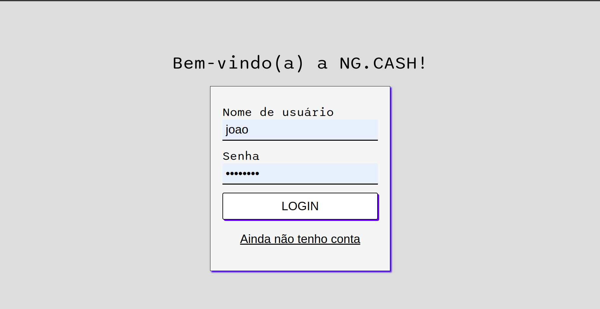
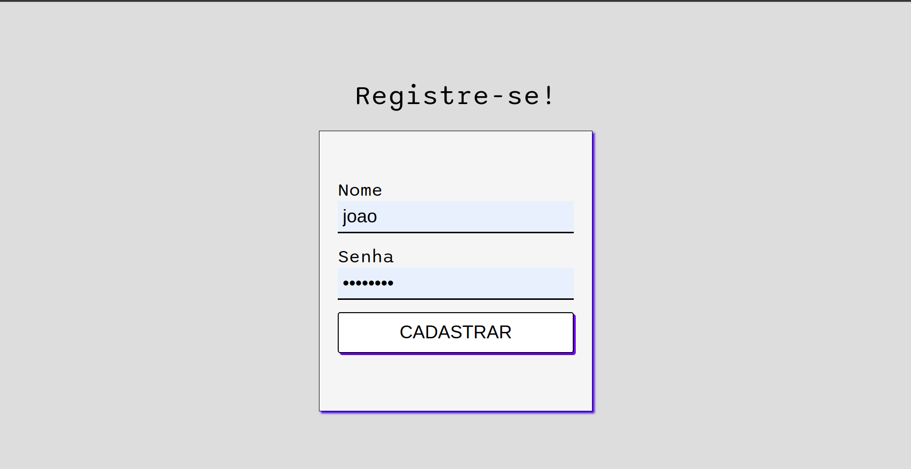
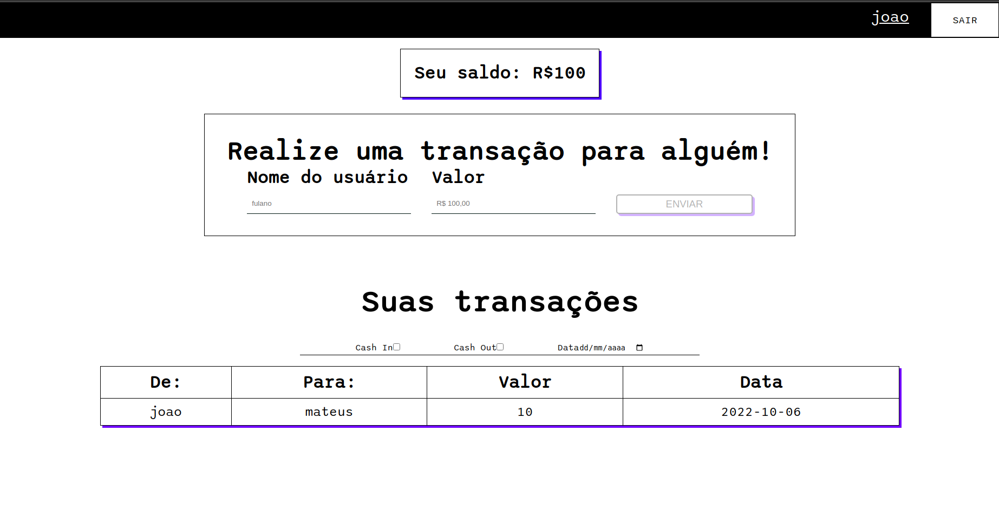

# Boas vindas ao repositório do Pojeto NG.CASH!

Aqui, está o projeto Full-Stack desenvolvido para o processo seletivo da _NG.CASH_!
Leia esse documento para as instruções de como iniciar o projeto e suas especificações.

# 🤔 Sobre o que é?

Aqui você terá acesso ao contexto geral do projeto, ou seja, seu tema central.

  

  A `NG.CASH` _(segundo o [site ofical](https://ng.cash/))_ é uma carteira digital da Nova Geração, que te ajuda a alcançar a independência financeira.

  Dito isso, esse projeto visa simular uma plataforma de transações financeiras entre usuários. 

  Saiba mais como criar sua `CONTA`, e começar a transferir para outros usuários adiante no **README**

## O projeto é composto de 4 entidades importantes para sua estrutura:

<strong> 🎲 Banco de Dados</strong>
 

**Resumo**

O banco de dados utilizado é o PostgreSQL, criado em um container `Docker` através da *_ORM_* `Sequelize`. 
É composto por 3 tabelas: `Users`, `Accounts` e `Transactions` que segue o esquema de relacionamentos abaixo:

**Tecnologias usadas:**
  - Sequelize
  - PostgreSQL
  - Docker

<strong> 💿 Back-end</strong>
 

**Resumo**

O Back-End é uma _API_ Node.js, construida utilizando os métodos `MSC`, `CRUD` e `POO`. Com o `TypeScript` para o controle de tipos,
`Sequelize` para comunicação com o Banco, `Express` para usar métodos HTTP, `Mocha`, `Chai` e `Sinon` para testes, `Docker` para _conterização_,
entre outras.

**Tecnologias usadas:**
  - TypeScript
  - Node.js
  - Sequelize
  - Express
  - Nodemon
  - Mocha
  - Chai
  - Sinon
  - Docker

<strong> 🧑‍💻 Front-end</strong>
 

**Resumo**

O Front-End foi construido utilizando o framework `React.js` com `Hooks` e componentes funcionais. O `Context` foi usado
para gerenciar o estado global, `Axios` para realizar as requisições ao *Backend* , `react-router-dom` para as rotas e o `Docker` para _conterização_.
Ele possui 3 paginas: `Login`, `Register` e `Account`, respectivamente:

**Tecnologias usadas:**
  - React.js
  - ReactHooks
  - Context
  - Axios
  - react-router-dom
  - Docker

<strong> 🐳 Docker</strong>
 

**Resumo**

A aplicação toda roda no `Docker`. Ela foi criada usando o `docker-compose` na raiz do projeto e os respectivos
`Dockerfiles` do front-end e back-end.

**Tecnologias usadas:**
  - Docker
  - docker-compose

# Orientações

## Antes de começar
Leia essa parte atentamente, pois aqui você encontrará informações importantes para preparar corretamente o setup do projeto.

<strong> ⚠️ Configurações mínimas para execução do projeto</strong>
 

Na sua máquina você deve ter:

 - (opcional) Sistema Operacional baseado em Linux 
 - Node versão 16
 - Docker
 - Docker-compose versão >=1.29.2

➡️ O `node` deve ter versão igual ou superior à `16.14.0 LTS`:
  - Para instalar o node, acesse [esse link](https://nodejs.org/en/)

➡️ O`docker-compose` deve ter versão igual ou superior à`ˆ1.29.2`:
  * Saiba como instala-lo na [documentação oficial](https://docs.docker.com/compose/install/)

### 🔰 Iniciando o projeto

  1. Clone o repositório `git clone git@github.com:joaomfg/projeto-ng-cash.git`

  2. Entre na pasta do repositório que você acabou de clonar:
  * `cd projeto-ng-cash`

  3. Instale as dependências
  * `npm install`

  4. Inicie o docker-compose e aguarde
  * `npm run compose:up`

  5. Após a inicialização do projeto for concluída, acesse no seu navegador:
  * [`http://localhost:3000`](http://localhost:3000)

  6. Se tudo deu certo, basta criar uma conta e atingir
  sua independência financeira

<strong> ⚠️ DICAS!</strong>
 

   - Use comando `npm run compose:down` para finalizar a aplicação

   - A extensão do _VS Code_  [Docker](https://github.com/microsoft/vscode-docker) ajuda a vizualizar a aplicação!

   - Caso ocorra algum erro com a inicialização, made um email para _joaomarcelofg@hotmail.com_

_Esse projeto foi desenvolvido por João Marcelo Franco Gomes, todos os direitos reservados @ 2022_
